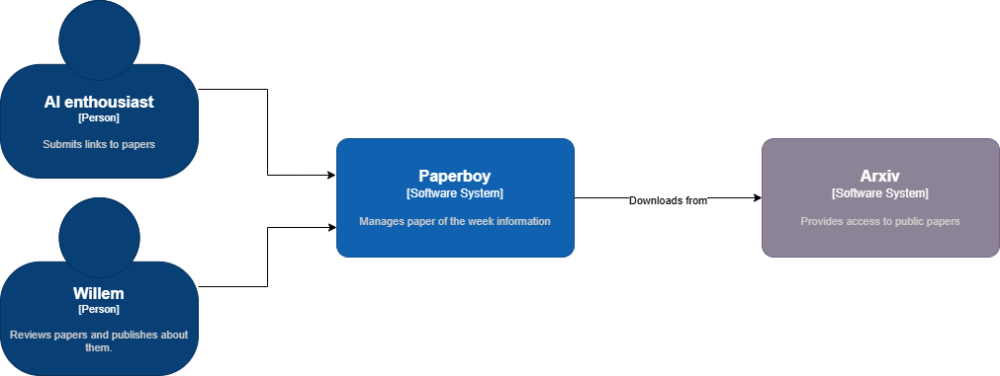

# Context and scope

This section covers the context and scope of the Paperboy solution.

Paperboy is used by two groups of people:

1. The owner of the system (Willem)
2. People who are sharing papers

For now, we only allow papers published on Arxiv as this is a source that's technically the most reliable website
for downloading and reading papers. 
