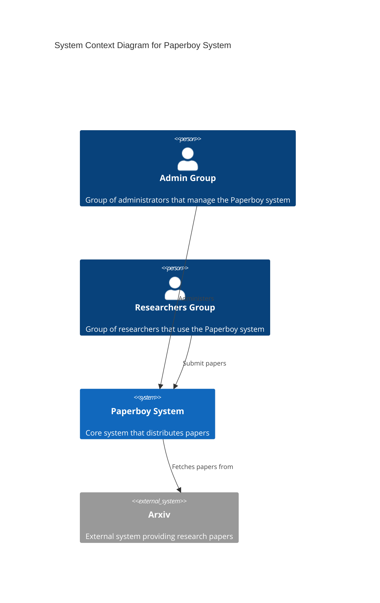
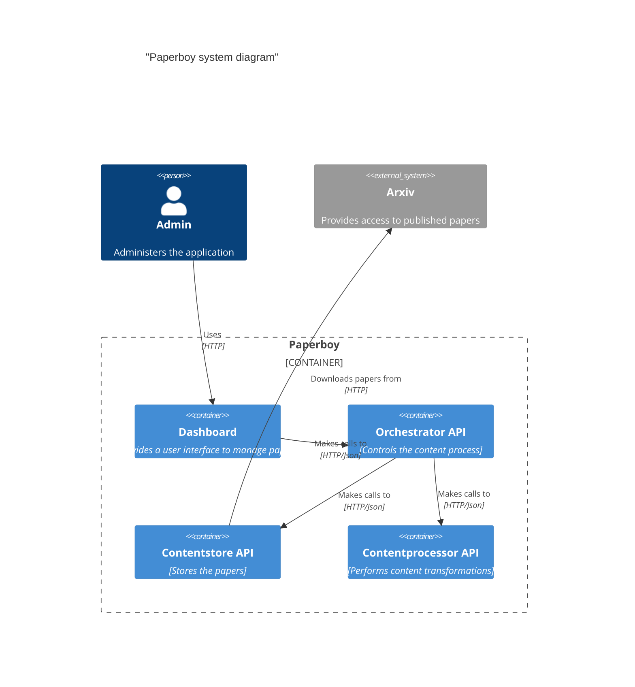
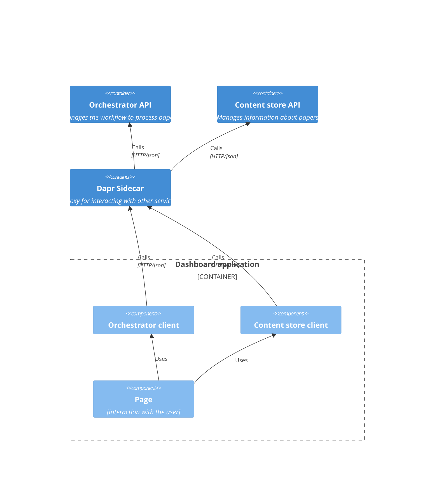
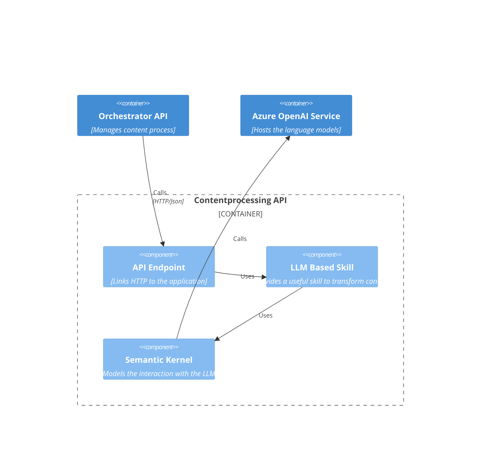
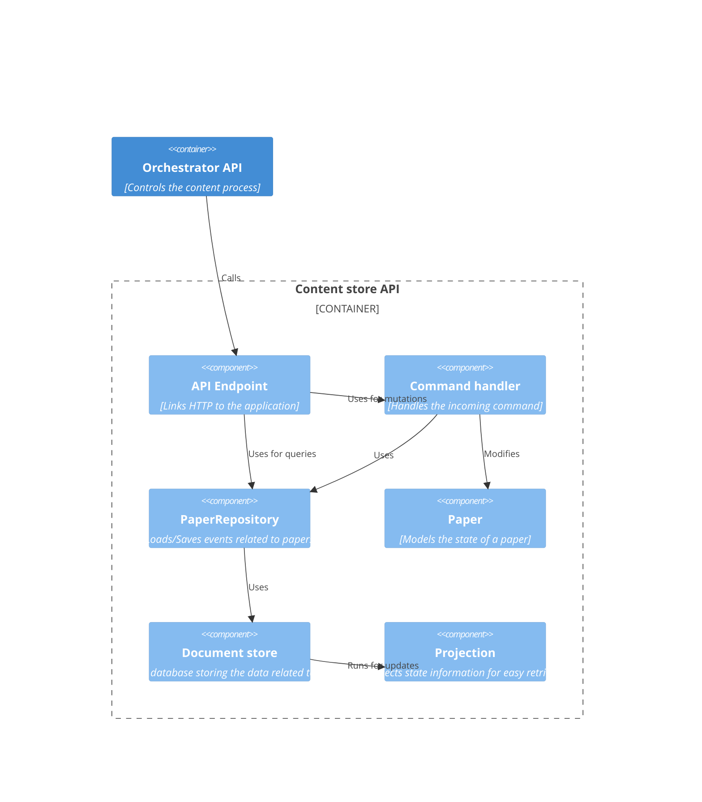
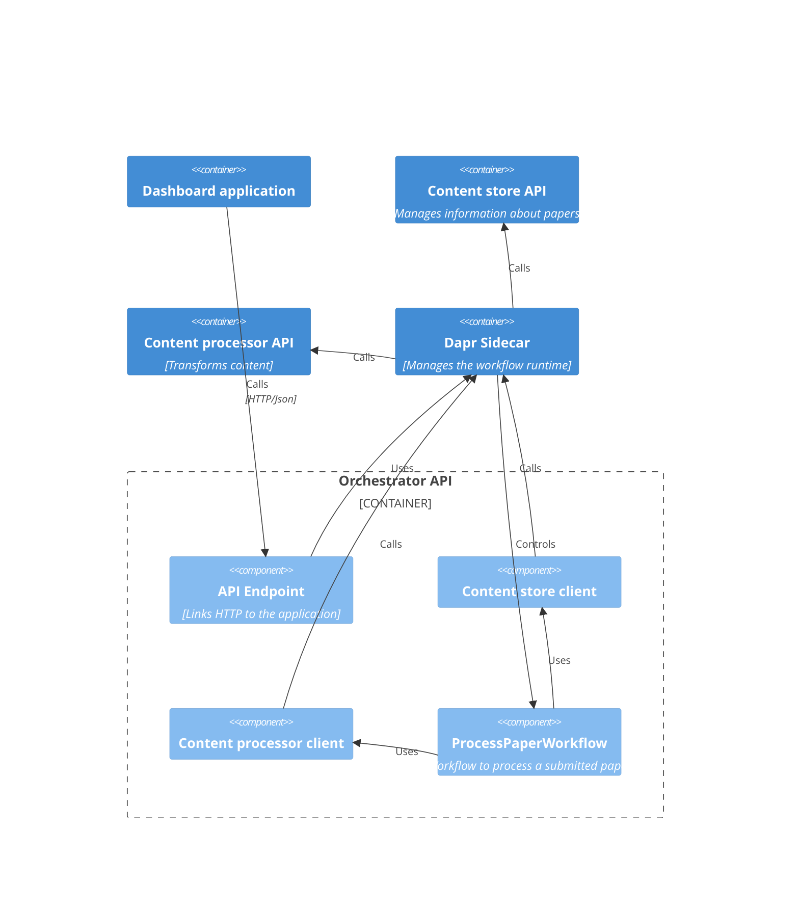

# Building blocks view

This section covers the various containers, and components that make up the paperboy system.

## System context

## Paperboy system

The paperboy system is made out of a number of microservices, and a frontend `dashboard`.
The structure of the paperboy system is shown below.

## Dashboard application

The dashboard application is a Blazor web application that's used by administrators to manage submitted papers.
Papers are initially submitted by sending a message to one of the administrators. The administrators then import
the paper using a form in the dashboard application.

The dashboard application structure is shown below:

The primary pattern in the dashboard application is through a set of pages. The logic to communicate
with the other microservices is done via the corresponding clients.

The clients use Dapr the method invocation building block in Dapr to communicate to the services. This interaction pattern provides us with automatic retries.

## Content processor API

The content processor API transforms content of papers into various shapes. The general structure of contentprocessor 
API is shown below:

Each transformation in the API is defined in a Skill component. For example, 
[SummarizePageFunction](../apps/contentprocessor/PaperBoy.ContentProcessor/Skills/Summarization//SummarizePage/SummarizePageFunction.cs) 
is a skill that is part of the contentprocessor.

Skills use [Semantic Kernel](https://github.com/microsoft/semantic-kernel) to interact with Azure OpenAI Service.

## Content store API

The content store API manages information about submitted papers. The structure of the application is shown below:

## Orchestrator API

The orchestrator API models the workflow that processes submitted papers. This service uses the Dapr workflow building block.
Using the workflow building block we can be sure that the workflow steps can be retried when one of the transformations fails.

The structure of the orchestrator is shown below:

The content processing workflow is made out of the main workflow class `ProcessPaperWorkflow`. Each step
in the workflow is modeled as an activity class in the `PaperBoy.Orchestrator.Activities` namespace.

The workflow itself stores no external state. It passes output from activities into follow-up activities.
Information about papers is stored in the content store.